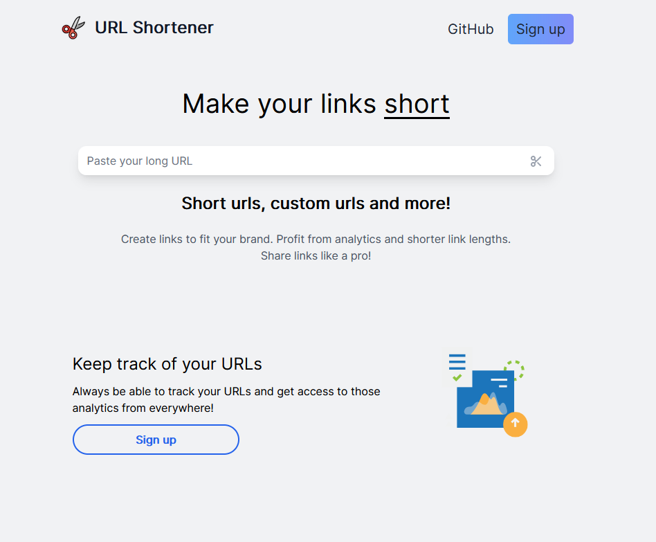
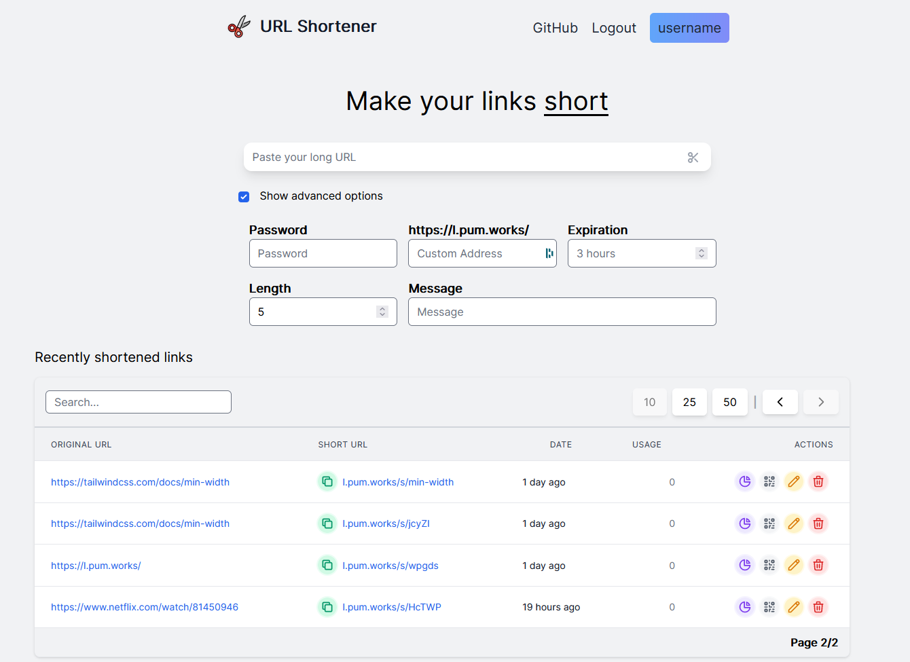
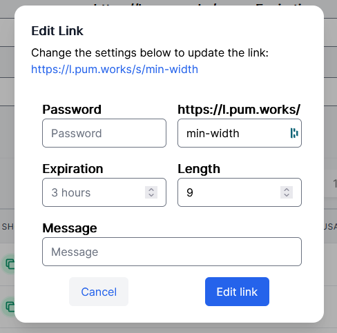
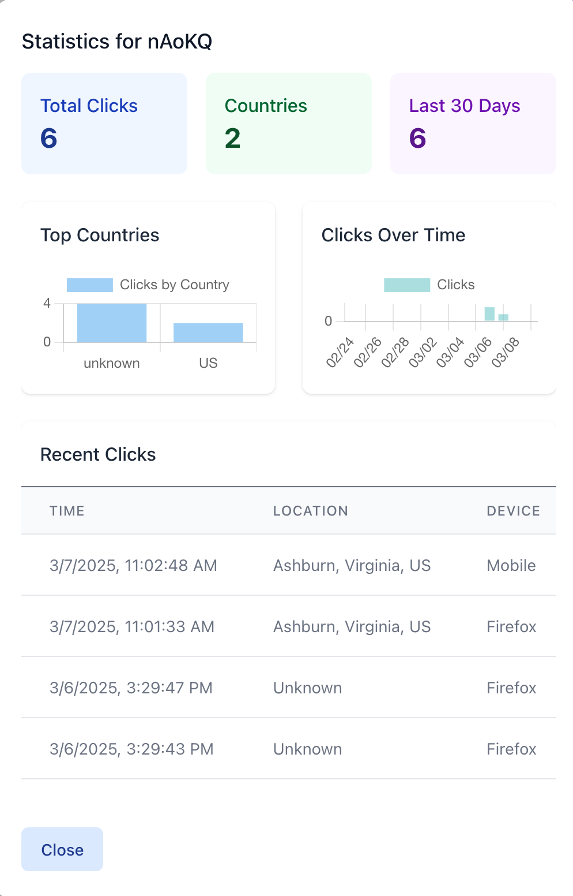

# Link Shortener

A link shortener written in Typescript using NextJS, React and TailwindCSS

## Features

- Shorten URLs with multiple options
- Edit, delete or get a QR code for them
- View your recently shortened links in a table
- Detailed analytics for your links including:
  - Total clicks and geographic distribution
  - Timeline of clicks over time
  - Device and browser information
  - Recent click activity

## Setup

1. Download the source code

2. Set up a [Xata Database](https://xata.io/) and [Fauna Database](https://fauna.com/)

3. Set up the .env file (see .env.example)

4. It's suggested to host this service on [Vercel](https://vercel.com/) to automatically support the serverless functions

## Images

- ##### The landing page:

    

- ##### Logged in view

    

- ##### Editing Modal

    

- ##### Analytics Modal

    
